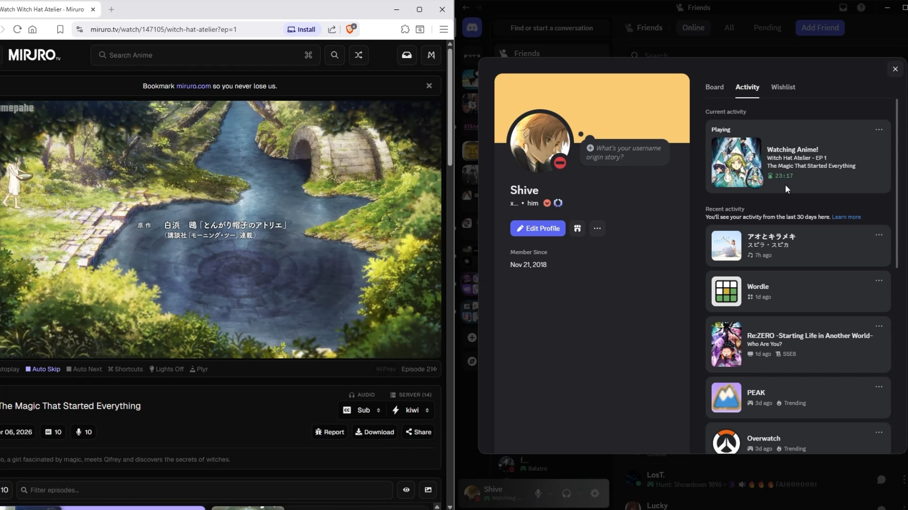

# Anime Activity Tracker for Discord

  
  
  

Automatically streams whatever anime you're watching directly onto your Discord profile as a Rich Presence Card (RPC), complete with a time-remaining tracker, paused states, anime-title detection, and episode-title detection.

  
   
  
<b>↑ Click to view demo ↑</b>

## Requirements

Before installing, make sure you have the following installed on your machine:
* **Python 3.8+** 
* **Discord Desktop App** (The tracker will not sync if you only use Discord in a web browser)
* A Chromium-based web browser (**Google Chrome**, **Microsoft Edge**, **Brave**, **Opera**, etc.)

## Installation & Setup

### Part 1: Install the Tracker
1. Download the latest `AnimeTracker_Setup.exe` from the [Releases Page](https://github.com/xShive/Anime-Activity-Tracker/releases).
2. Run the installer and follow the on-screen instructions.
3. Once the installation finishes, an **installation folder** will automatically open on your screen. Keep this window open.
  
### Part 2: Loading the Browser Extension
1. Open your browser's extension manager:
   - Chrome/Brave/Edge: Type `chrome://extensions` in your address bar.
   - Opera GX: Type `opera://extensions` in your address bar.
2. In the top-right corner, toggle **Developer Mode to ON.**
3. Click the **Load Unpacked** button that appears on the top-left.
4. Select the extension folder that opened automatically.

The extension is now active! Simply watch an anime on a supported site, and your Discord status will update automatically.

## Supported Websites

The tracker natively supports the following domains:
- `crunchyroll.com`
- `miruro.tv`
- `miruro.bz`

## Adding Support for New Websites

Want to track shows, anime, or movies on a website that isn't supported yet? You can easily add it by updating two files. 
*(Note: Instructions on how to do this are in `content.js` as well.)*

1. **Update `manifest.json`:**
   Add the new website domain to the `host_permissions` and `content_scripts` arrays so the extension has permission to "see" series data on that new site.
2. **Update `content.js`:**
   Add a new entry to the `SITE_CONFIGS` object. You will need to **use your browser's Inspect Element tool** to find the correct CSS selectors for that site:
   - `animeTitle`: The CSS selector for the show's name.
   - `episodeTitle`: The CSS selector for the episode's name.
   - `episodeNum`: The CSS selector for the episode's number.
   - `timestamps`: The CSS selector for the video time (e.g., `.current-time` and `.total-duration`).
   - `cover`: The CSS selector for the poster image.
   - `video`: The CSS selector for the pause function.

**Tips for finding selectors:**
- `Ctrl + Shift + C` allows you to click any element on the website to view the corresponding code.
- Test your selectors using `document.querySelector('your-selector-here')` in the console to ensure they return the correct elements.

## FAQ

### Q: Why does Windows display a "This PC is protected" or Firewall warning?
A: This is a standard Windows security feature for any custom application that has not been digitally signed by a paid developer certificate. Because this is an open-source project managed locally, Windows does not recognize the publisher. You can safely click "More info" and then "Run anyway" to proceed.

### Q: How do I ensure this tool is safe to use?
A: The source code of this project is publicly available, which you can use to verify its safety. The tracker runs entirely locally on your machine and only interacts with website data to scrape the current video status. It does not log anything else related to your browser.

### Q: Why doesn't the status appear on my Discord profile?
A: If your activity is not showing, please follow these steps to troubleshoot:
- Ensure the **Discord Desktop app** is fully running. The tracker will not sync if you are using the browser-based version of Discord.
- Open your browser's extension page and ensure the **extension is enabled** and that you have "Developer Mode" toggled on.
- Open your browser's **console** while on the website to see if there are any **error messages** related to the extension failing to load or scrape data. Each request being sent should get printed in the console.
- If you are using a site not officially supported, ensure your **CSS selectors** in `content.js` are correct by testing them in the browser console using `document.querySelector('your-selector-here')`.